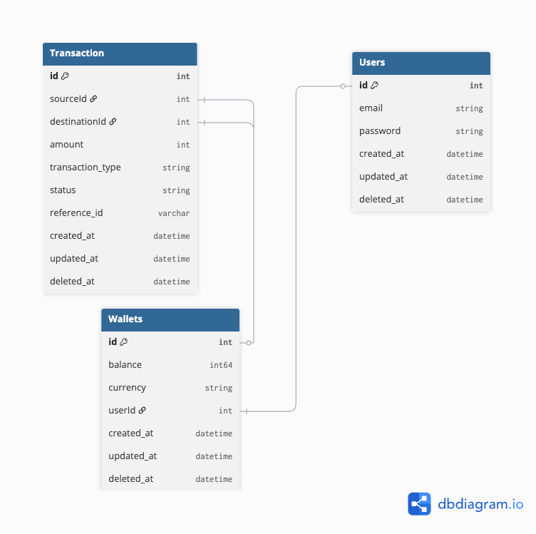

# 💰 E-Wallet API Service

Backend API สำหรับระบบกระเป๋าเงินอิเล็กทรอนิกส์ (E-Wallet) พัฒนาด้วยภาษา **Go** โดยใช้โครงสร้าง **Clean Architecture** เพื่อความง่ายในการขยายระบบ (Scalability) และการทดสอบ (Testability)

---

## 🚀 Features
- **Authentication**: ระบบเข้าสู่ระบบแบบ Cookie-based Auth (JWT) พร้อมฟีเจอร์ Login/Logout
- **User Management**: ระบบสมัครสมาชิกและจัดการข้อมูลผู้ใช้
- **Wallet System**: จัดการยอดเงินในกระเป๋า (Balance) ของแต่ละผู้ใช้
- **Transactions**: ระบบโอนเงินระหว่างบัญชีที่รองรับ **ACID Transactions** (เงินไม่หายระหว่างทาง)
- **API Documentation**: เอกสาร API แบบ Interactive ด้วย Swagger UI

## 🛠 Tech Stack
- **Language**: Go 1.23+
- **Framework**: [Fiber v3](https://gofiber.io/)
- **Database**: PostgreSQL 16
- **ORM**: GORM
- **Infrastructure**: Docker & Docker Compose
- **Documentation**: Swag (Swagger)

## 🗄 Database Schema

*รูปภาพแสดงความสัมพันธ์ระหว่างตาราง User, Wallet และ Transactions*

## 🏗 Project Structure
โปรเจกต์นี้จัดโครงสร้างตามหลัก **Clean Architecture** แยกส่วนการทำงานชัดเจน:
- `cmd/`: จุดเริ่มต้นของแอปพลิเคชัน (Entry point)
- `internal/delivery/`: ส่วนรับ Request เช่น HTTP Handlers, Routes และ Middleware
- `internal/usecases/`: ส่วนของ Business Logic หลักของระบบ
- `internal/repository/`: ส่วนติดต่อสื่อสารกับ Database (GORM)
- `internal/domain/`: ส่วนเก็บ Models และ Interfaces ทั้งหมด
- `pkg/`: Shared utilities ที่ใช้ร่วมกันในโปรเจกต์

## 📖 API Documentation
สามารถดูรายละเอียด Endpoint ทั้งหมดและทดสอบยิง API ได้ผ่าน Swagger UI ที่:
👉 http://localhost:8080/swagger/index.html

## 🏁 Getting Started


### 1. Clone the repository
```bash
git clone https://github.com/supakrit-petpon/ewallet-api.git
cd e-wallet-api
```

### 2. Setup Environment Variables
```bash
cp .env.example .env
```

### 3. Run with Docker Compose
```bash
docker compose up --build
```